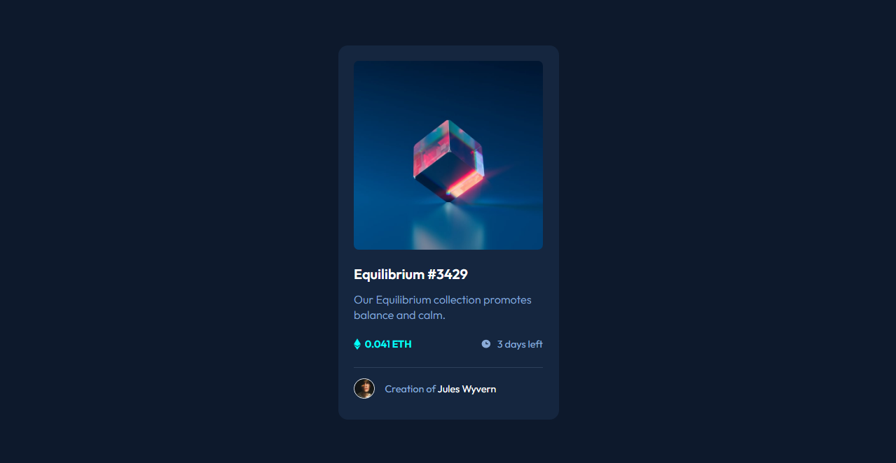
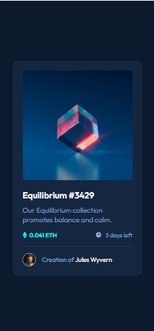

# Frontend Mentor - Order summary card solution

This is a solution to the [NFT preview card component challenge on Frontend Mentor](https://www.frontendmentor.io/challenges/nft-preview-card-component-SbdUL_w0U). 
 

## Overview

 

 
 
 

## Screenshot

### Desktop Version

### Mobile Version

### Links

- [Solution in Front End Mentor Site:](https://www.frontendmentor.io/solutions/nft-preview-card-component-7-GfK5bKTr)
- [Live Site](https://nft-card-lake.vercel.app/)

 
 

## My process

Another challenge similar to the previous ones but this time I tried to use new things I'm learning, like improving semantic HTML5 markup, CSS Grid and Mobile-first workflow.

 
I'm getting better at using Figma, which is speeding up the first steps of starting to create the page.

 
The main difficulty was creating the overlay effect when hovering the cursor over the image. I got a satisfactory result regarding the background color but I didn't get the same with the "view", it should have the solid white color, and not be affected by `opacity: 0.5;`. Any better way to do this?

## Author

- Frontend Mentor - [@VitorMagnago](https://www.frontendmentor.io/profile/VitorMagnago)